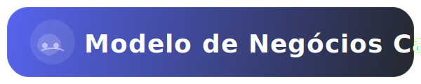

# Projeto Canvas 

> 💡 Este projeto foi desenvolvido especialmente para a comunidade [nome da comunidade]!  
> Sinta-se à vontade para contribuir, compartilhar ideias e participar.

## Acesse o projeto no Google Colab

---

 
 Olá, Tudo Bem? Eu sou o Luis Henrique mas pode me chamar de Ls, Muito Prazer! tenho 18 anos e estudar programação é o que eu chamo de Hobby! O Projeto Canvas é um projeto sobre o Modelo de Negócios Canvas feito no Colab (Plataforma do Google) que tem suporte para atualizações recentes da IA ​​Gemini (do Google também), feito durante a 2 temporada da Imersão IA da Alura!

! Este projeto passou por uma série de etapas e processos para que pudese funcionar, eu explicarei usando uma metodologia chamada **Golden Circle**: "Por Quê?", "Como?" e "O Quê?"

 

- **Por Quê?**

  Este projeto foi feito em prol de ajudar em um problema real. Isso não se relaciona com ganhar dinheiro, mas tem a ver com o propósito.
  

- **Como?**

  A criação desse projeto foi feita com base em 4 passos de acordo com a banca avaliadora:  **Utilidade, Criatividade, Eficácia e Apresentação**

  
- **O Quê?**

  É o Modelo de Negócios Canvas Online. "O que faz ele ser util, eficáz e criativo?". O fato dele estar na internet é o que torna ele especial, ele é util pois um modelo de negócios bem estruturado faz uma empresa crescer como nunca. Ele é a criativo pois a criação de um site de modelo de negócios é algo que irá impactar e impulsionar o mercado de trabalho, feito nas mãos certas, sai um trabalho assertivo e conclual. Por fim, ele é eficáz, como eu disse antes, um modelo de negócios nas mãos certas, um simples código assim como um simples pensamento, pode impactar geração com conhecimento, eu tenho como exemplo de tudo isso que eu citei até agora, o grande salto no mundo da tecnologia que os irmãos **Guilherme e Paulo Silveira** deram de passar de uma escola de tecnologia chamada **Caelum** criada em 2005 na capital paulista para pessoas que já sabiam programação para uma **Plataforma Online** chamada **Alura**, criada em 2005 e que atualmente é a **é a maior escola online de tecnologia do Brasil.**
 

----

## Sobre:

 O Projeto Canvas é um projeto feito com base em 4 passos citados acima, no tópico **Golden Circle** em **"Como?"**

 ### Utilidade

  Temos um problema real nos dias de hoje que muitas pessoas tentam se reeinventar no mundo do empreendimento criando sua própria empresa! Seja por autonomia e liberdade, realização pessoal ou potencial de ganhos financeiros, porém, muitos desses empreendedores acabam por se frustar por não saber estruturar bem a base de uma empresa iniciante ou emergente no mercado de trabalho. Por isso eu estruturei um código com python, e mais algumas bibliotecas importadas para criar o Modelo de Negócios Canvas Online, simulando exemplos de perguntas específicas com base em um livro da faculdade onde hoje sou universitário chamada "Negócios em TI - Canvas" com mais algumas perguntas que eu procurei por websites para que a IA atualizada responda com precisão o que é melhor para o seu cliente para que assim seja criado um plano de negócios bem estruturado.

 ### Criatividade

   Em questão a criatividade no desenvolvimento do projeto, eu serei sincero, não sou um programador, muito menos um programador em python, essa é a minha primeira vez utilizando a linguagem python e a plataforma Google Colab do Google, tentei de muitas maneiras fazer com que eu pudesse estilizar, estruturar e animar o projeto com HTML, CSS e JavaScript sem que tivesse que recorrer a outras plataformas com mais acessibilidade pois, o intuito do projeto era monta-lo conforme a aula 4/5 da imersão, então foi total desição minha de que eu mesmo me limitasse a plataforma, tentei meu melhor explorando cada função dos códigos gerados e cada ação tomada pela IA Gemini atualizada quando eu precisava de ajuda.

 ### Eficácia
 
   A eficácia que esse projeto apresenta é maior até do que eu imagino, pois um modelo de negócios bem estruturado pode mudar a vida de milhares de pessoas, faz uma venda de bairro virar uma multi-nacional, algo tão grande que por si só consegue mudar a rota do mundo com inovações como muitas empresas e startups por ai pelo mundo, ressaltando novamente o impacto que vemos hoje a plataforma Alura dos irmãos Silveiras.
   

## Linguagens

- ### **Python**

  
  A linguagem Python foi responsavel por criar todo o código do Projeto Modelo de Negócios Canvas, uma linguagem única com uma diversidade de variantes. Python é uma linguagem de programação de alto nível, interpretada e de fácil leitura, conhecida por sua sintaxe simples e clara. Muito utilizada em áreas como desenvolvimento web, ciência de dados, automação, inteligência artificial e scripts, Python é uma das linguagens mais populares do mundo. Sua vasta comunidade e biblioteca padrão abrangente facilitam o desenvolvimento de projetos de todos os tamanhos, tornando-a uma excelente escolha tanto para iniciantes quanto para profissionais experientes.

----

- ### **Mark-Down**

  
  A linguagem de marcação de texto MarkDown foi utilizada para criar o readme do projeto, vindo contar com alguns comando de outras linguagens como HTML & CSS. Markdown é uma linguagem de marcação simples e fácil de usar, criada para formatar textos de forma rápida e legível. Com ela, é possível adicionar títulos, listas, links, imagens, trechos de código e outros elementos, tornando documentos mais organizados e agradáveis de ler. Markdown é amplamente utilizada em READMEs, blogs, documentações e plataformas como GitHub, por sua praticidade e compatibilidade.

----

- ### **CSS & HTML**

  
  
  A Linguagem de texto HTML5 e a Linguagem de estilização CSS3 foram responsáveis por auxiliar na arquitetura do arquivo readme do projeto, tendo em vista que podemos utilizar de alguns recursos dessas linguagens dentro do readme. HTML estrutura o conteúdo das páginas web, enquanto CSS define o visual e o layout. Juntas, são essenciais para criar sites bonitos e organizados.

----

## Ferramentas & Plataformas

- ### **Gemini**

  
  Gemini é uma família de modelos de inteligência artificial desenvolvida pelo Google DeepMind. Lançada a partir de 2023, a Gemini foi projetada para ser multimodal, ou seja, capaz de compreender e gerar conteúdo em diferentes formatos, como texto, imagens, áudio e vídeo.
O modelo se destaca por seu desempenho avançado em tarefas complexas de linguagem natural, raciocínio lógico e integração de múltiplos tipos de dados, sendo uma das principais apostas do Google para competir com outros grandes modelos de IA, como o GPT da OpenAI.
A Gemini é utilizada em diversos produtos do Google, incluindo o Bard (agora chamado Gemini), trazendo melhorias em pesquisa, produtividade e assistência automatizada.

----

- ### **Colab**

  
  Google Colab (ou Colaboratory) é uma plataforma gratuita do Google que permite programar em Python diretamente no navegador, com foco especial em ciência de dados, aprendizado de máquina e inteligência artificial. Ele oferece notebooks interativos semelhantes ao Jupyter Notebook, onde você pode combinar código, texto (Markdown), visualizações e outros recursos em um mesmo documento.

----

<!-- Badges -->

| Função         | Status              |
|----------------|------------------------|
| `Issues`       |             |
| `Pull_Request`  |   |
| `Commit`       |          |
| `Release`  |                |

----

